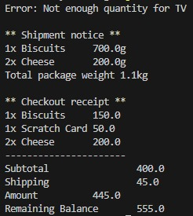

# E-Commerce System 

This project is a basic simulation of an e-commerce system in Java. It supports product management, cart operations, checkout with balance and stock validation, and handles shipping logic.

## Features
- Define products with name, price, quantity.
- Add items to cart with specific quantities.
- Prevent adding expired or out-of-stock products.
- Calculate subtotal, shipping cost, and total amount.
- Reject checkout if:
  - Cart is empty
  - Insufficient customer balance
  - Product is expired or unavailable
- Handle shippable items via a ShippingService.

## Assumptions
- Each shippable product adds 15 EGP shipping.
- Products can’t be purchased if expired or out of stock.
- Shipping is only for shippable items.

## Example Output

